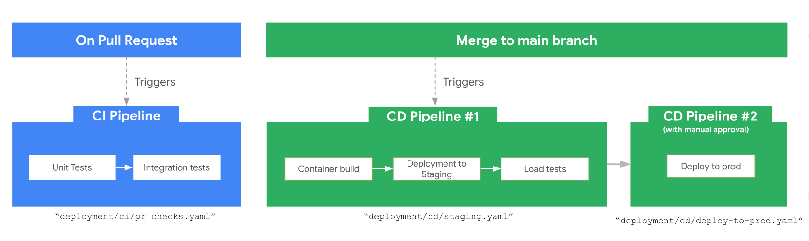

# 배포

개발 환경 또는 CI/CD 파이프라인을 통한 운영 환경에 에이전트를 배포하세요.



---

## 인프라 대 배포

**인프라** (`agents-cli infra`)는 서비스 계정, IAM 바인딩, API, 텔레메트리 버킷, Terraform 상태 등 에이전트에 필요한 클라우드 리소스를 프로비저닝합니다. 배포를 위한 기반을 마련하지만 에이전트를 직접 실행하지는 않습니다.

**배포** (`agents-cli deploy`)는 에이전트 코드를 받아 프로비저닝된 인프라에 올립니다. 컨테이너를 빌드하고 레지스트리에 푸시한 후 서비스를 시작합니다.

일반적인 흐름: 먼저 인프라를 프로비저닝한 다음, 그 위에 배포를 진행합니다.

---

## 개발 환경에 배포하기

배포를 실행하는 가장 간단한 방법:

**1. 개발 프로젝트 설정:**

```bash
gcloud config set project YOUR_DEV_PROJECT_ID
```

**2. 에이전트 배포:**

```bash
agents-cli deploy
```

이 명령은 `agents-cli-manifest.yaml`(`create_params` 항목 아래)에서 `deployment_target`을 읽어 적절한 흐름으로 전달합니다:

| `deployment_target`  | 수행되는 작업                                  |
|----------------------|-----------------------------------------------|
| `agent_runtime`      | Agent Runtime 배포 (완전 관리형)       |
| `cloud_run`          | `gcloud beta run deploy` (Cloud Run 상의 컨테이너) |
| `gke`                | Terraform + Docker 빌드 + `kubectl apply`     |

배포 타깃은 프로젝트를 생성할 때 설정됩니다:

```bash
agents-cli create my-agent -d cloud_run    # 또는 agent_runtime, gke
```

기존 프로젝트의 배포 타깃을 변경하려면 `scaffold enhance`를 사용하세요:

```bash
agents-cli scaffold enhance -d cloud_run
```

사용 가능한 모든 옵션을 확인하려면 `agents-cli scaffold enhance --help`를 실행하세요.

!!! tip
    관측 가능성(Observability) 기능(프롬프트-응답 로깅, 콘텐츠 로그 등)을 활성화하려면 배포 후 `agents-cli infra single-project`를 실행하세요. Terraform이 텔레메트리 리소스를 프로비저닝하고 해당 리소스를 사용하도록 서비스를 업데이트합니다. 자세한 내용은 [관측 가능성 가이드](observability/index.md)를 참고하세요.

**작동 여부 확인:**

```bash
agents-cli deploy --list    # 배포 목록 조회
agents-cli deploy --status  # 배포 상태 확인
```

---

## 배포 타깃

### Agent Runtime

*`agents-cli create my-agent -d agent_runtime`으로 선택하거나 `agents-cli-manifest.yaml`의 `create_params.deployment_target: agent_runtime`으로 설정합니다.*

완전 관리형 런타임입니다. (자동 생성되는) `Dockerfile`을 제공하면 Agent Engine이 컨테이너를 빌드하고 실행하므로 직접 운영할 클러스터나 서비스가 필요하지 않습니다:

```bash
agents-cli deploy --project my-gcp-project --region us-east1
```

Docker 빌드 인자나 컨테이너 포트를 전달할 수 있습니다. 사전 빌드된 `--image`는 지원되지 않습니다(Agent Runtime은 항상 Dockerfile에서 빌드함):

```bash
agents-cli deploy --build-args KEY=VALUE --port 8080
```

비동기 배포 상태 확인:

```bash
agents-cli deploy --no-wait     # 시작 후 즉시 반환
agents-cli deploy --status      # 나중에 진행 상황 확인
```

### Cloud Run

*`agents-cli create my-agent -d cloud_run`으로 선택하거나 `agents-cli-manifest.yaml`의 `create_params.deployment_target: cloud_run`으로 설정합니다.*

소스 코드에서 컨테이너를 빌드하여 Cloud Run 서비스로 배포합니다:

```bash
agents-cli deploy --project my-gcp-project --region us-east1
```

리소스 제한 오버라이드:

```bash
agents-cli deploy --memory 8Gi --port 8080
```

소스 빌드 대신 사전 빌드된 이미지 배포:

```bash
agents-cli deploy --image gcr.io/my-project/my-agent:v1
```

!!! tip
    `agents-cli` 플래그를 통해 제공되지 않는 더 고급 Cloud Run 배포 기능이 필요한 경우, `--dry-run`(또는 `-n`)을 사용하여 전체 `gcloud` 명령을 출력하세요. 그 후 명령을 복사하여 필요한 플래그를 추가로 붙여 실행할 수 있습니다.

### GKE

*`agents-cli create my-agent -d gke`로 선택하거나 `agents-cli-manifest.yaml`의 `create_params.deployment_target: gke`로 설정합니다.*

Terraform과 kubectl을 사용하여 GKE 클러스터에 배포합니다:

```bash
agents-cli deploy --cluster-name my-cluster --project my-gcp-project
```

---

## 다음 단계

- [CI/CD 및 프로덕션](cicd.md) — 스테이징 및 프로덕션을 위한 자동화 파이프라인 설정
- [관측 가능성](observability/index.md) — 배포된 에이전트 모니터링
