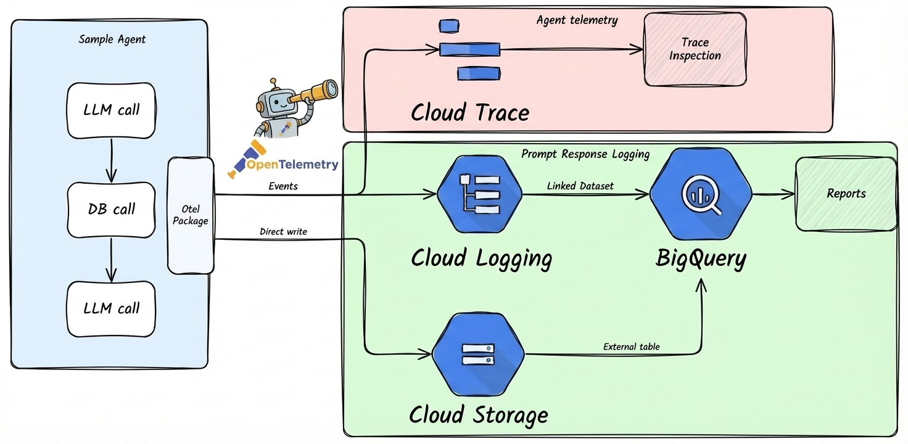

# Cloud Trace

*에이전트를 배포한 후 트레이싱이 잘 작동하는지 확인하고 텔레메트리 데이터를 조사하려는 개발자를 위한 가이드입니다.*



Cloud Trace는 모든 `agents-cli` 프로젝트에 기본적으로 활성화되어 있습니다. 이 가이드에서는 작동 여부를 확인하고 텔레메트리 데이터를 쿼리하는 방법을 설명합니다.

---

## 배포 환경에서 트레이싱 검증하기

개발 환경에 배포한 후 텔레메트리 데이터가 정상적으로 전달되는지 확인하세요:

### 1. 배포 및 테스트 트래픽 생성

```bash
gcloud config set project YOUR_DEV_PROJECT_ID
agents-cli deploy
```

에이전트에 몇 가지 테스트 요청을 보내세요.

### 2. 트레이스 확인

Google Cloud Console을 열고 **Trace > Trace 탐색기**로 이동합니다. 각 요청에 대한 트레이스와 함께 LLM 호출 및 도구 실행을 나타내는 스팬을 확인할 수 있습니다.

### 3. 프롬프트-응답 로깅 검증 (선택 사항)

GCS 및 BigQuery로의 프롬프트-응답 로깅은 Terraform(`agents-cli infra single-project` 또는 `agents-cli infra cicd`)에 의해 프로비저닝되며, 로그 버킷과 데이터셋을 생성하고 `LOGS_BUCKET_NAME`을 설정하여 자동으로 활성화됩니다. 단순 `agents-cli deploy`는 이러한 리소스를 생성하지 않으므로, 아래 검증 단계는 Terraform으로 프로비저닝된 배포에만 적용됩니다.

```bash
PROJECT_ID="your-dev-project-id"
PROJECT_NAME="your-project-name"

# GCS에서 텔레메트리 파일 확인
gsutil ls gs://${PROJECT_ID}-${PROJECT_NAME}-logs/completions/

# BigQuery에서 텔레메트리 쿼리
bq query --use_legacy_sql=false \
  "SELECT * FROM \`${PROJECT_ID}.${PROJECT_NAME}_telemetry.completions\` LIMIT 10"
```

데이터가 나타나지 않는 경우:

1. 서비스 계정에 `storage.objectCreator` 역할(권한)이 있는지 확인합니다.
2. 배포 환경 변수에 `LOGS_BUCKET_NAME`이 설정되어 있는지 확인합니다.
3. Cloud Logging의 애플리케이션 로그에서 텔레메트리 설정 경고를 확인합니다.

---

## 로컬에서 프롬프트-응답 로깅 활성화하기

기본적으로 `agents-cli playground`는 프롬프트-응답 로깅 없이 실행됩니다. 텔레메트리는 선언적 방식(런타임 `setup_telemetry()` 없음)이므로, 로컬에서 완성(completions) 로깅을 활성화하려면 배포된 에이전트에 Terraform이 설정하는 것과 동일한 변수를 설정하세요 (ADK 에이전트 전용):

```bash
export LOGS_BUCKET_NAME="your-dev-project-id-your-project-name-logs"   # 순수 버킷 이름, gs:// 제외
export OTEL_INSTRUMENTATION_GENAI_CAPTURE_MESSAGE_CONTENT="NO_CONTENT"  # 또는 로그에 전체 콘텐츠를 포함하려면 EVENT_ONLY
export OTEL_INSTRUMENTATION_GENAI_COMPLETION_HOOK="upload"
export OTEL_INSTRUMENTATION_GENAI_UPLOAD_BASE_PATH="gs://your-dev-project-id-your-project-name-logs/completions"
export OTEL_INSTRUMENTATION_GENAI_UPLOAD_FORMAT="jsonl"
export OTEL_SEMCONV_STABILITY_OPT_IN="gen_ai_latest_experimental"
agents-cli playground
```

---

## 배포 환경에서 프롬프트-응답 로깅 비활성화하기

배포된 환경에서 이를 비활성화하려면 `deployment/terraform/single-project/service.tf` 파일을 수정하세요:

```hcl
env {
  name  = "OTEL_INSTRUMENTATION_GENAI_CAPTURE_MESSAGE_CONTENT"
  value = "false"
}
```

그런 다음 적용하세요:

```bash
cd deployment/terraform/single-project
terraform apply -var-file=vars/env.tfvars
```

---

## 설정 레퍼런스

| 변수 | 값 | 용도 |
|---|---|---|
| `LOGS_BUCKET_NAME` | GCS 버킷 **이름** (`gs://` 제외) | 프롬프트-응답 로깅에 필수입니다. 설정되지 않으면 로깅이 비활성화됩니다. |
| `OTEL_INSTRUMENTATION_GENAI_CAPTURE_MESSAGE_CONTENT` | `NO_CONTENT`, `EVENT_ONLY`, `SPAN_ONLY`, `SPAN_AND_EVENT` | 트레이스/이벤트 내부 콘텐츠만 제어합니다 (버킷이 설정되면 항상 전체 콘텐츠를 캡처하는 GCS/BigQuery completions에는 영향을 주지 않음). 실험적 시맨틱 컨벤션(`OTEL_SEMCONV_STABILITY_OPT_IN` 설정 적용): `NO_CONTENT` = 스팬/이벤트에 콘텐츠 없음(기본값), `EVENT_ONLY` = Cloud Logging 이벤트에 콘텐츠 포함, `SPAN_*` = 트레이스 스팬에 콘텐츠 포함. `true`/`false`는 유효하지 않으며 거부되어 `NO_CONTENT`로 폴백됩니다. |
| `OTEL_INSTRUMENTATION_GENAI_COMPLETION_HOOK` | `upload` | 완성(completion) 레코드 업로드 활성화 |
| `OTEL_INSTRUMENTATION_GENAI_UPLOAD_BASE_PATH` | `gs://<bucket>/completions` | 완성 레코드 저장 대상 경로 |
| `OTEL_INSTRUMENTATION_GENAI_UPLOAD_FORMAT` | `jsonl` | 업로드 포맷 |
| `OTEL_SEMCONV_STABILITY_OPT_IN` | `gen_ai_latest_experimental` | GenAI completion/upload 시맨틱 컨벤션에 필수 |
| `ADK_CAPTURE_MESSAGE_CONTENT_IN_SPANS` | `false`, `true` | 프롬프트/응답 콘텐츠를 트레이스 스팬에서 제외 (`false`, 기본 설정값) |
